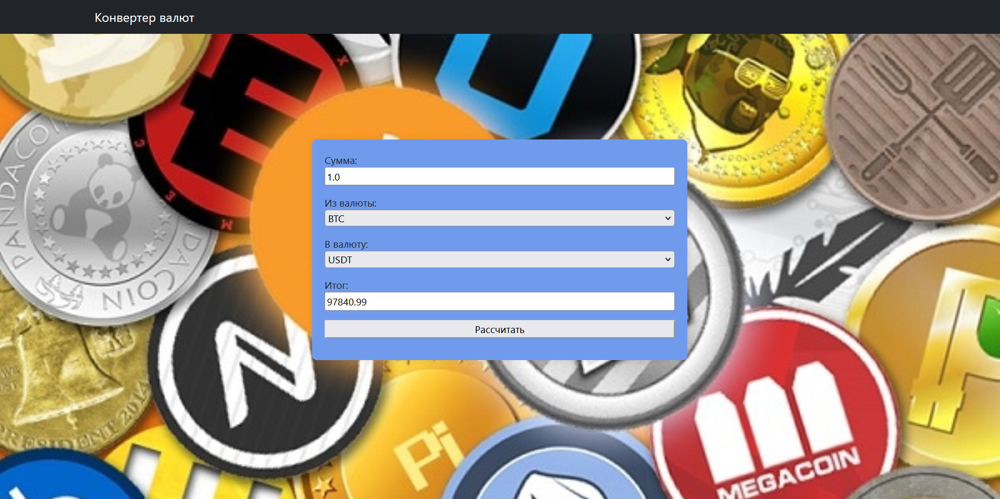

## Django_crypto_converter


Веб приложение для конвертирования различных криптовалют.
## Окно приложения
  
## Инструкция по установке.
1. **Откройте терминал и выполните следующую команду для клонирования репозитория**
  ```sh
  git clone https://github.com/Listochek1/django_crypto_converter.git
  ```

2. **Создание виртуального окружения**
  ```sh
  python -m venv venv
  ```
4. **Активация виртуального окружения**
- На Windows:
  ```sh
  .\venv\Scripts\activate
  ```
- На macOS/Linux:
  ```sh
  source venv/bin/activate
  ```
5. **Установка необходимых зависимостей**
  ```sh
  pip install -r requirements.txt
  ```
6. **Запуск приложения**
  ```sh
  python .\manage.py runserver
  ```
##Как использовать
### 1. Запуск приложения
- Откройте браузер и перейдите по адресу http://127.0.0.1:8000/
- Вы увидите основное окно калькулятора
### 2. Использование 
- Выберите нужную пару валют и количество
- Нажмите Кнопку "Рассчитать"

